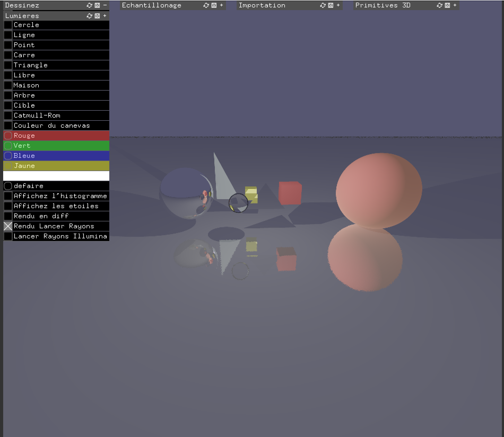
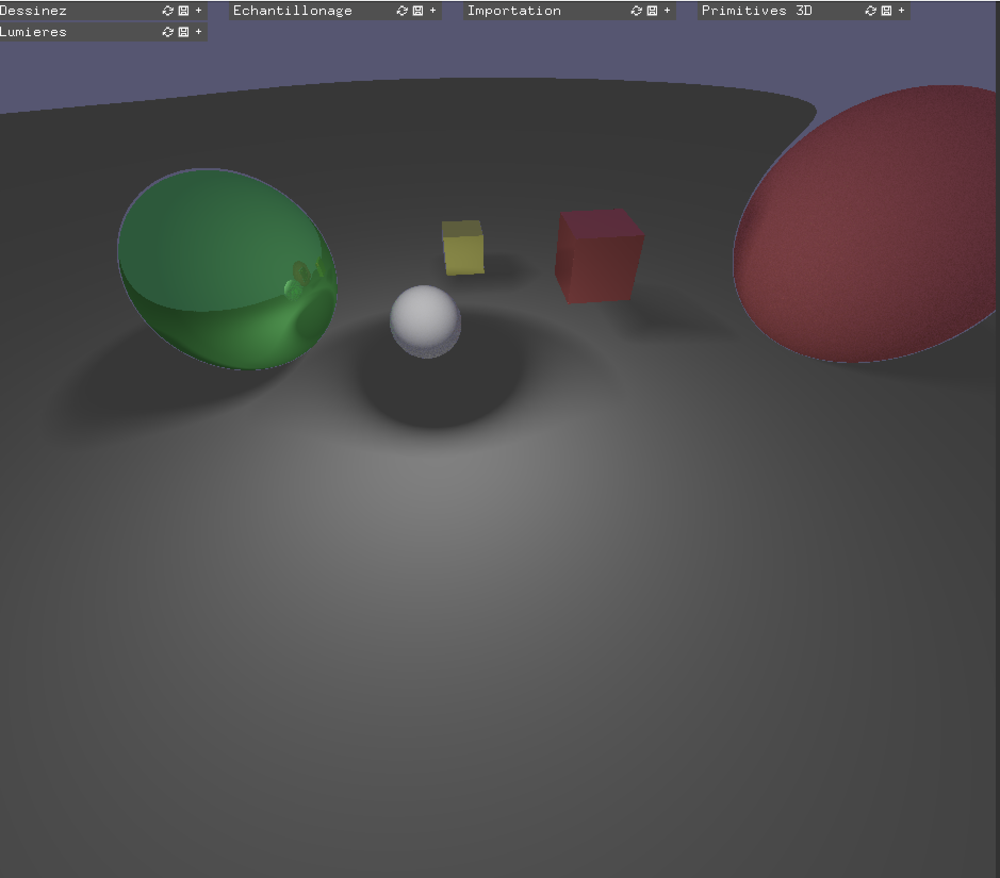
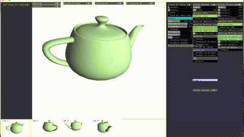

# Mini 3D Graphics Engine

A **real-time 3D graphics engine** built in C++ using [openFrameworks](https://openframeworks.cc/).  
Inspired by Blender, this engine combines advanced rendering techniques with interactive scene manipulation, supporting both 3D modeling and 2D/3D creative workflows.

## Technical Features

### 3D Graphics & Rendering
- **3D Mesh Loading & Texture Mapping**: Import OBJ models with multiple texture coordinates; supports procedural textures evolving over time.  
- **Cubemap & HDR Environment Lighting**: Procedural skyboxes and HDRI lighting for realistic reflections.  
- **Multiple Illumination Models**: Lambert, Gouraud, Phong, Blinn-Phong, and cel-shading.  
- **Parametric Surfaces & Curves**: Catmull-Rom curves and Bézier surfaces with live control point editing.  
- **Ray Tracing**: Real-time intersections, reflections, refractions, shadows, and global illumination for selected primitives.  
- **Physically-Based Rendering (PBR)**: Metalness, roughness, microfacet materials with dynamic lighting response.  
- **Deferred Rendering Pipeline**: Multi-pass rendering with shadow mapping support.  
- **Scene Graph & Camera System**: Hierarchical management of 2D/3D objects with multiple camera views.

### User Interaction & Creative Tools
- **Image Module**: Import/export images, color palette selection, and live color histograms.  
- **Vector Drawing Module**: Draw 2D/3D primitives (points, lines, rectangles, circles, triangles, cubes, spheres, etc.) and custom shapes with RGB/HSV color controls.  
- **Scene Transformation & Hierarchy**: Multi-selection, editable scene graph, bounding boxes, and variant models (metallic, plastic, wireframe, transparent).  
- **Camera Controls**: Interactive camera with orbital/natural modes, multiple viewpoints, focus auto-centering, and occlusion culling via Quadtree.  
- **Dynamic Cursor & Interface Panels**: Real-time cursor adaptation for different drawing modes and intuitive panel-based editing.

---

## Screenshots

  
  

---

## Build & Run

### Prerequisites
- [openFrameworks](https://openframeworks.cc/download/)
- IDE: CLion or Visual Studio
- Platform: Windows (MSYS2) or macOS (Xcode)

### Windows
1. Install C++ libraries via MSYS2.  
2. Place openFrameworks at `C:/openFrameworks/`.  
3. Open the project in CLion and configure using `CMakeLists.txt`.  
4. Build and run.

### macOS
1. Install Xcode and command line tools: `xcode-select --install`.  
2. Clone this repo to a suitable folder.  
3. Generate the project using the openFrameworks project generator.  
4. Open in Xcode or CLion, build, and run.

---

## Resources & References
- 3D Models: [Free3D](https://free3d.com/3d-models/obj), [CraftmanSpace](https://www.craftsmanspace.com/)  
- HDR Images: [PolyHaven](https://polyhaven.com/hdris)  
- Procedural Textures: [Poliigon](https://www.poliigon.com/texture/ledger-stone-wall-texture-mixed-gray/7000)  
- Deferred Rendering: [RigelRenderer](https://github.com/M1sterius/RigelRenderer), [ModernOpenGL](https://github.com/fendevel/ModernOpenGL)  
- Ray Tracing: [Ray Tracing in One Weekend](https://raytracing.github.io/books/RayTracingInOneWeekend.html)

---

## Français

Moteur 3D temps réel développé en C++ avec openFrameworks.  
Fonctionnalités avancées : chargement de modèles 3D, textures procédurales, HDR, PBR, lancer de rayons et rendu différé, ainsi que des outils de dessin et de manipulation 2D/3D interactifs.
